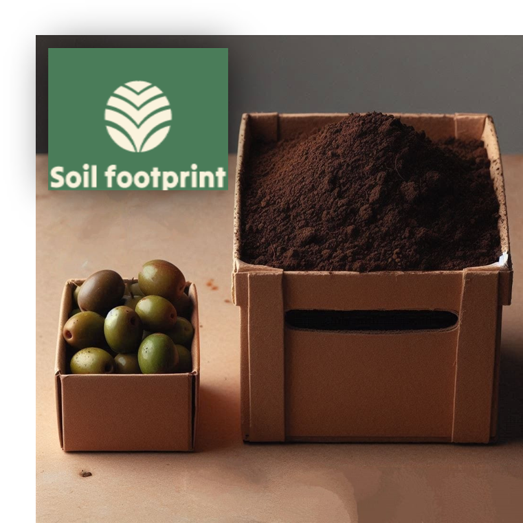
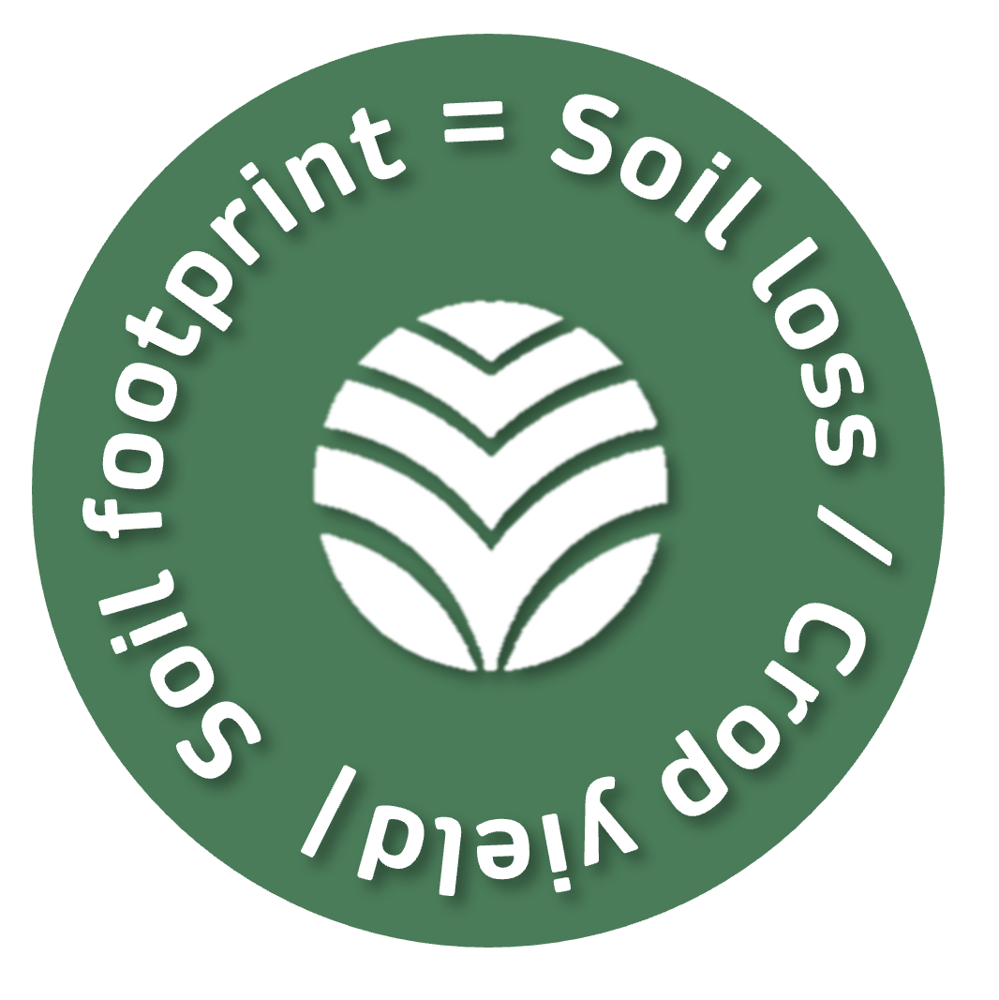

The “soil footprint” is emerging as a crucial concept in sustainable farming, measuring the impact of agriculture on soil erosion.

As the global population grows, the challenge of feeding everyone without depleting essential natural resources becomes more pressing.

While much focus has been placed on carbon and water footprints, the soil footprint addresses the often-overlooked issue of soil degradation.

Tackling soil degradation is key to preserving life and ensuring long-term agricultural productivity.

## Introducing the soil footprint project

Scientists Andrés Peñuela, Vanesa García Gamero, and Tom Vanwalleghem at the University of Córdoba have been instrumental in defining and applying the concept of the soil footprint in Spain, where soil erosion presents a critical challenge for agricultural sustainability.

Through their pioneering work, the experts have brought attention to an often-underappreciated yet vital resource: soil.

Unlike the more widely known carbon and water footprints, this latest footprint specifically focuses on soil – a resource that is frequently overlooked in discussions about environmental sustainability but is just as crucial for supporting life as water, air, or energy.

## How is the soil footprint calculated?

Healthy soil is the foundation of productive ecosystems, ensuring food security, biodiversity, and climate resilience.

The soil footprint quantifies the amount of soil lost during cultivation, offering a clear metric for evaluating agricultural practices. It is calculated by dividing the erosion rate by the crop’s productivity, providing a tangible way to measure the sustainability of farming techniques.

A larger soil footprint indicates significant soil erosion, which can lead to devastating losses in essential nutrients, biodiversity, and the soil’s ability to retain water.

## Soil-footprint Notebooks

You can run the Notebooks online just by clicking on these links:

[Understanding the Soil Footprint of Our Diet](https://mybinder.org/v2/gh/Soil-footprint/Soil-footprint/HEAD?urlpath=notebooks/The%20soil%20footprint%20in%20our%20diet.ipynb)

[The Soil footprint of food consumption in Spain](https://mybinder.org/v2/gh/Soil-footprint/Soil-footprint/HEAD?urlpath=notebooks/The%20soil%20footprint%20in%20Spain.ipynb)

[Soil footprint Github repository](https://github.com/Soil-footprint)

## Online questionnaire: we would like to know your opinion about the soil footprint

[Soil footprint questionnaire](https://docs.google.com/forms/d/e/1FAIpQLScVE3zPnUdXt65AjO3m6f15aVcy1WSm6C_ElWuUd9qzGDlYDw/viewform?usp=sf_link)

[Encuesta en español](https://docs.google.com/forms/d/e/1FAIpQLSdwH7tF1xyY0JXaccqEDoxydr9HqjI8l9a1lpici4cXrs37qQ/viewform?usp=sf_link)

## Citation

https://doi.org/10.1016/j.soisec.2024.100156

## Acknowledgements
This work was supported by the project “Soil footprint, a simple indicator to communicate and manage soil sustainability in Spain” (SoilFoot) (DU.01.MR.21.07 TED2021-132415B-I00), funded by MCIN/AEI/10.13039/501100011033 and the EU “NextGenerationEU”/PRTR.

&nbsp;

   

