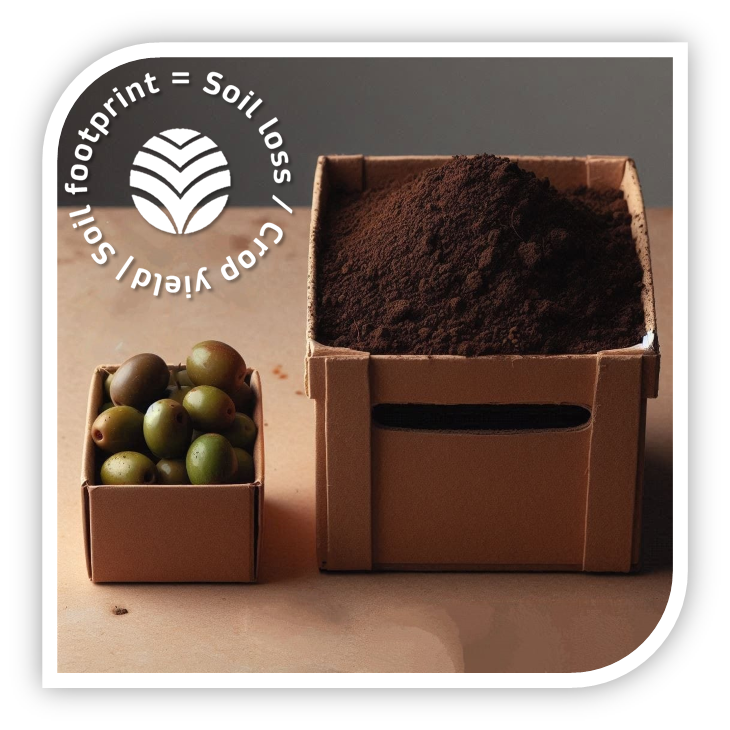
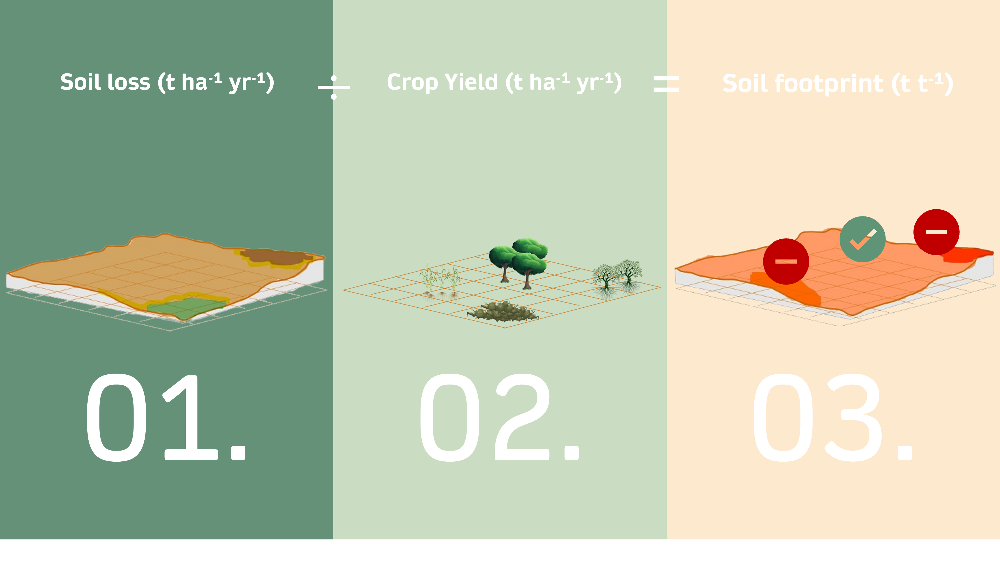
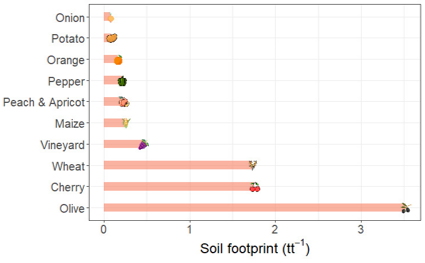

# Soil footprint: A simple indicator to communicate and quantify soil sustainability

<h>

The "soil footprint" is a key metric in sustainable farming, measuring agriculture's impact on soil erosion. As the global population grows, balancing food production with resource preservation is crucial. While carbon and water footprints are well-known, soil degradation remains overlooked.

## Understanding the Soil Footprint

Researchers Andrés Peñuela, Vanesa García Gamero, and Tom Vanwalleghem from the University of Córdoba have pioneered the soil footprint concept in Spain, where erosion threatens sustainability. Unlike carbon and water footprints, this metric highlights soil loss, guiding efforts to combat degradation.

## Measuring the Soil Footprint

Healthy soil is the foundation of productive ecosystems, ensuring food security, biodiversity, and climate resilience.

The soil footprint quantifies the amount of soil lost during cultivation, offering a clear metric for evaluating agricultural practices. It is calculated by dividing the erosion rate by the crop’s productivity, providing a tangible way to measure the sustainability of farming techniques.

A high footprint signals excessive erosion, depleting nutrients and water retention capacity.

## Raising Awareness and Action

The goal is to highlight soil erosion, inspiring consumers and farmers to adopt sustainable practices. Just as demand for eco-friendly products influences industries, awareness of soil conservation can drive change.

<h>

## Spain’s Case Study

Applying this metric to Spain’s top crops, researchers found that olive trees had the largest footprint, followed by cherries and wheat, while onions, potatoes, and oranges had the smallest. The solution isn’t fewer olive trees but better soil management. Techniques like vegetation cover significantly reduce erosion.

## A Sustainable Future

The soil footprint offers a vital perspective on farming’s environmental impact. Protecting soil is as essential as conserving water and energy. Recognizing and addressing soil erosion is crucial for sustainable agriculture and global food security.

## Soil-footprint Notebooks

You can run the Notebooks online just by clicking on these links:

[Understanding the Soil Footprint of Our Diet](https://mybinder.org/v2/gh/Soil-footprint/Soil-footprint/HEAD?urlpath=notebooks/The%20soil%20footprint%20in%20our%20diet.ipynb)

[The Soil footprint of food consumption in Spain](https://mybinder.org/v2/gh/Soil-footprint/Soil-footprint/HEAD?urlpath=notebooks/The%20soil%20footprint%20in%20Spain.ipynb)

[Soil footprint Github repository](https://github.com/Soil-footprint)

## Online questionnaire: we would like to know your opinion about the soil footprint

[Soil footprint questionnaire](https://docs.google.com/forms/d/e/1FAIpQLScVE3zPnUdXt65AjO3m6f15aVcy1WSm6C_ElWuUd9qzGDlYDw/viewform?usp=sf_link)

[Encuesta en español](https://docs.google.com/forms/d/e/1FAIpQLSdwH7tF1xyY0JXaccqEDoxydr9HqjI8l9a1lpici4cXrs37qQ/viewform?usp=sf_link)

## Citation

https://doi.org/10.1016/j.soisec.2024.100156

## Acknowledgements
This work was supported by the project “Soil footprint, a simple indicator to communicate and manage soil sustainability in Spain” (SoilFoot) (DU.01.MR.21.07 TED2021-132415B-I00), funded by MCIN/AEI/10.13039/501100011033 and the EU “NextGenerationEU”/PRTR.

&nbsp;

   

